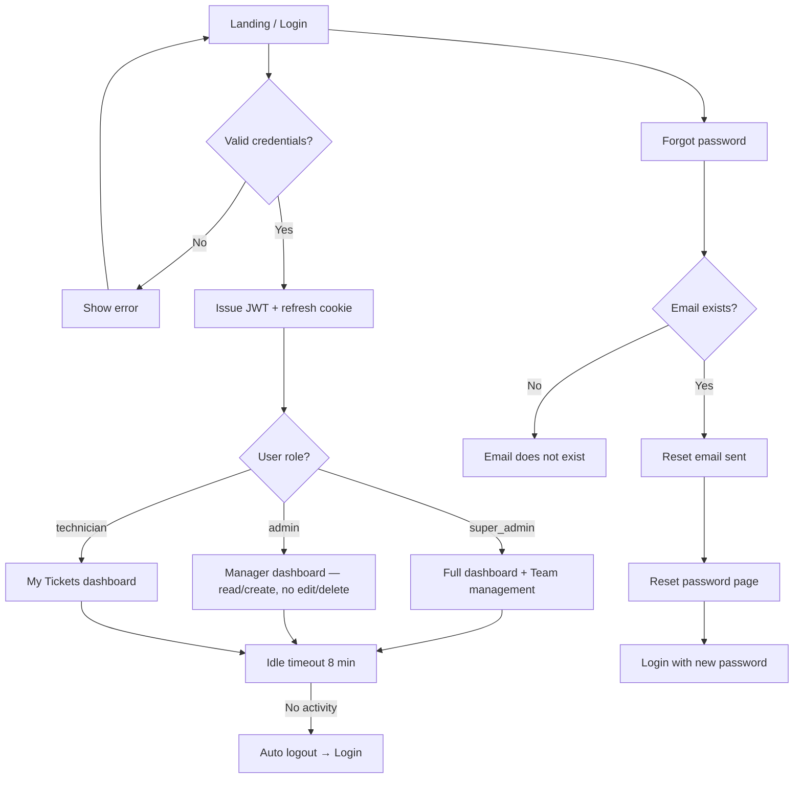
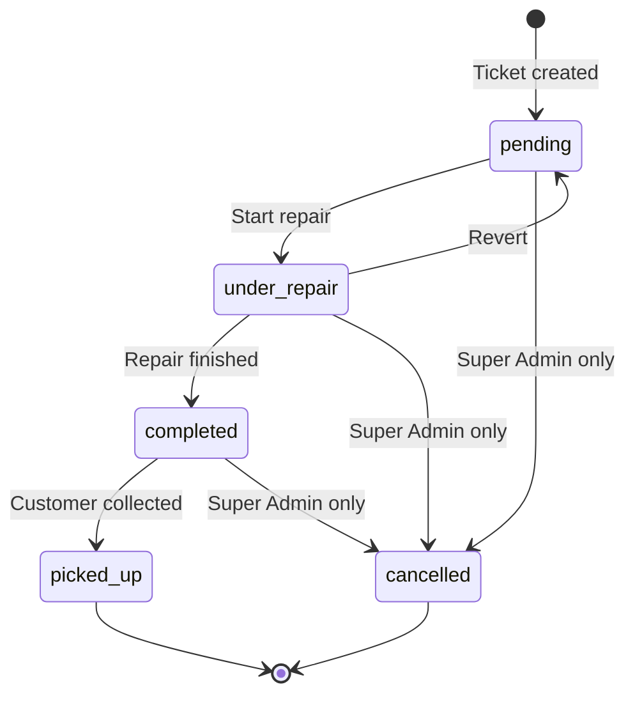
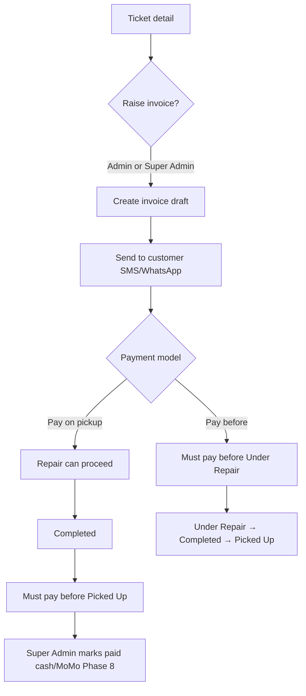
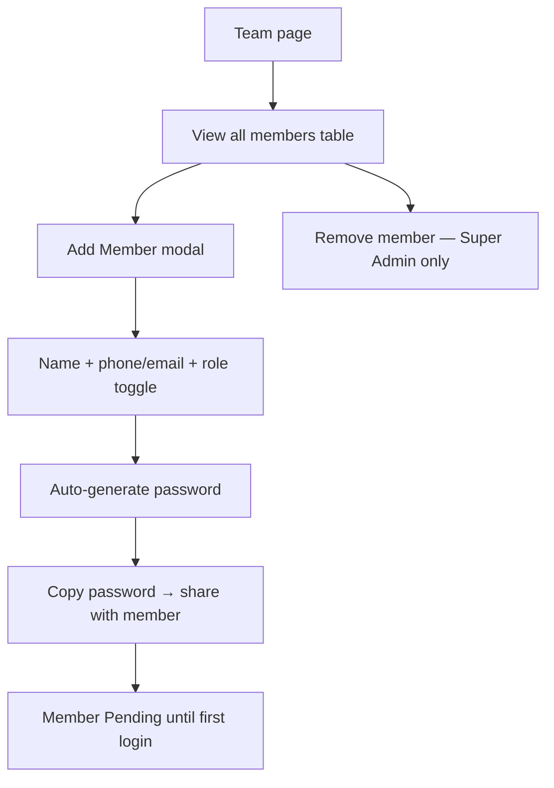
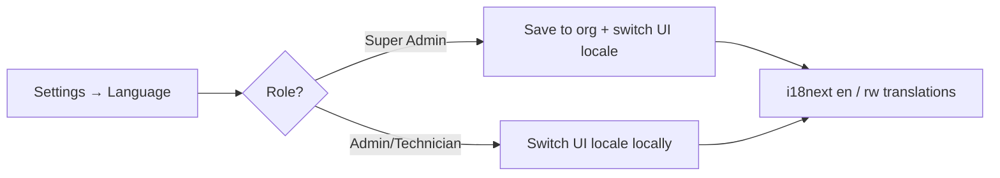
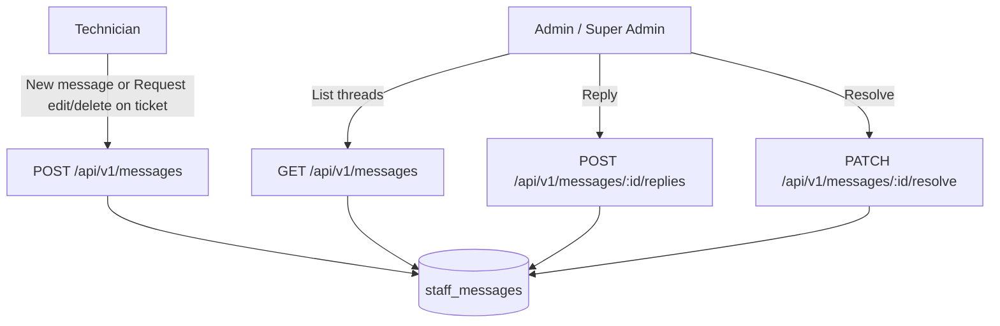

# StackFix — User Flow Diagram

> Living document tracking implemented user flows through all development phases.  
> Updated as new phases ship.

**Illustrated version:** Open [`StackFix_USER_FLOW.docx`](./StackFix_USER_FLOW.docx) in Word for rendered flowchart images, permission tables, and demo credentials. Regenerate with `pnpm docs:user-flow`.

---

## 1. Authentication & Session



**Implemented:** Login, logout (confirm modal), forgot/reset password, idle auto-logout, role-based redirect.

---

## 2. Role Permissions Matrix

| Action | Super Admin | Admin | Technician |
|--------|:-----------:|:-----:|:----------:|
| Create ticket | ✅ | ✅ | ✅ |
| View all tickets | ✅ | ✅ | Own only |
| Update ticket status | ✅ | ❌ | Own only |
| Edit ticket | ✅ | ❌ | ❌ |
| Delete ticket | ✅ | ❌ | ❌ |
| Create invoice | ✅ | ✅ | ❌ |
| View invoices/payments | ✅ | ✅ | ❌ |
| Mark invoice paid | ✅ | ❌ | ❌ |
| Edit/delete invoice | ✅ | ❌ | ❌ |
| Manage team | ✅ | View only | ❌ |
| Workshop settings | ✅ | Language only | Language only |
| Filter tickets by user | ✅ | ✅ | ❌ |

---

## 3. Repair Ticket Lifecycle



### When Completed & Picked Up become selectable

| Current status | Completed available? | Picked Up available? |
|----------------|---------------------|----------------------|
| **Pending** | ❌ — must go to Under Repair first | ❌ |
| **Under Repair** | ✅ | ❌ — must complete first |
| **Completed** | ✅ (current) | ✅ |
| **Picked Up** | ❌ (terminal) | ✅ (current) |

### Payment gates (workshop setting)

| Payment model | Gate |
|---------------|------|
| **Pay Before Service** | Invoice must be **paid** before Pending → Under Repair |
| **Pay on Pickup** | Invoice must be **paid** before Completed → Picked Up |
| Either model | No payment required for Under Repair → Completed |

---

## 4. New Repair Ticket Flow

```mermaid
flowchart LR
  A[New Repair form] --> B[Customer name + phone]
  B --> C[Device type / brand / model searchable]
  C --> D[Fault description + optional photo]
  D --> E[Submit]
  E --> F[Upsert customer by phone]
  F --> G[Create ticket — status Pending]
  G --> H[Set createdBy = current user]
  H --> I[Ticket detail page]
  I --> J[SMS/WhatsApp notification queued]
```



---

## 5. Invoice & Payment Flow



---

## 6. Team Management (Super Admin)



---

## 7. Search & Filter

```mermaid
flowchart LR
  A[Header search ⌘K] --> B[Enter query]
  B --> C[/tickets?q=query]
  C --> D[API search tickets + customers]
  E[Tickets page filter] --> F[Status tabs]
  E --> G[Filter by user — Admin/Super Admin]
```

---

## 8. Language (Settings)



Kinyarwanda UI strings are maintained in locale files (professionally translated; can be extended via translation API in backend).

---

## 9. In-App Messaging (Technician ↔ Admin)

Technicians send **edit**, **delete**, or **general** requests to Admins/Super Admins. Admins reply and mark threads **resolved**.



**UI:** `/messages` in sidebar for all roles. Ticket detail links pre-fill compose for technicians.

---

## 10. Confirm dialogs (standard modal)

Destructive actions (delete ticket, delete invoice, remove team member, log out) use **`ConfirmActionDialog`** — same overlay/shell as logout; only title, icon, and buttons change. Modals **fade in** (no zoom/pop-down). Failed API calls show a **toast**; the modal stays open.

**Delete rules (Super Admin):**

| Action | Behaviour |
|--------|-----------|
| Delete invoice | Allowed for unpaid/draft/sent; blocked if **paid** |
| Delete ticket | Removes ticket; **auto-deletes unpaid invoice**; blocked if invoice is **paid** |
| After delete | Tickets list updates immediately (no manual refresh) |

---

## 11. Phase Roadmap (flows not yet live)

| Phase | Flow |
|-------|------|
| 7 | OpenAPI docs, PDF invoices |
| 8 | MTN MoMo auto-payment → status update |
| 9 | WhatsApp/SMS delivery webhooks |
| 10 | Mobile app (technician field use) |
| 11 | Playwright E2E suite |
| 12 | Production deploy app.stackfix.app |
| 13 | Beta shop onboarding |

---

*StackForgeAI · hello@stackforgeai.africa · Last updated: Phase 6.3 (delete cascade, confirm dialog fixes)*
